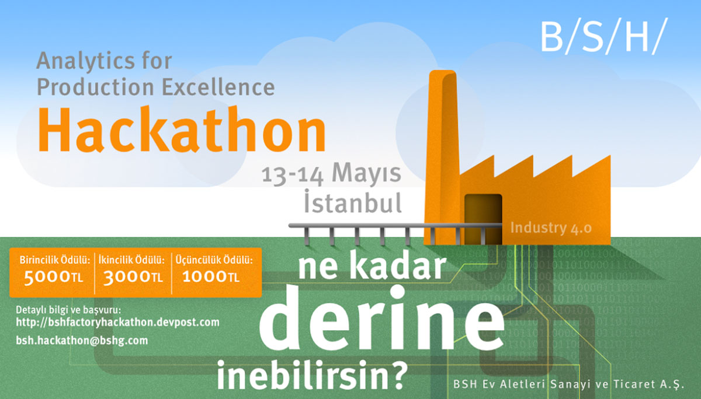
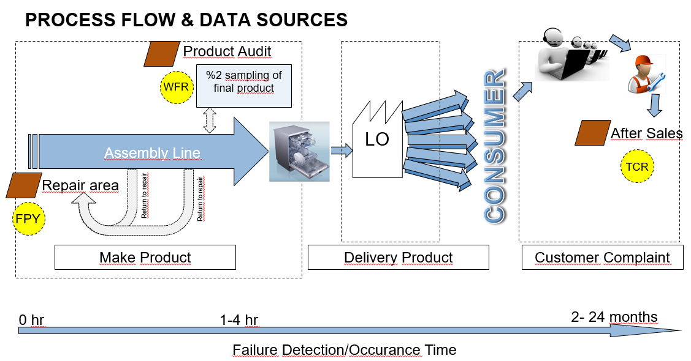
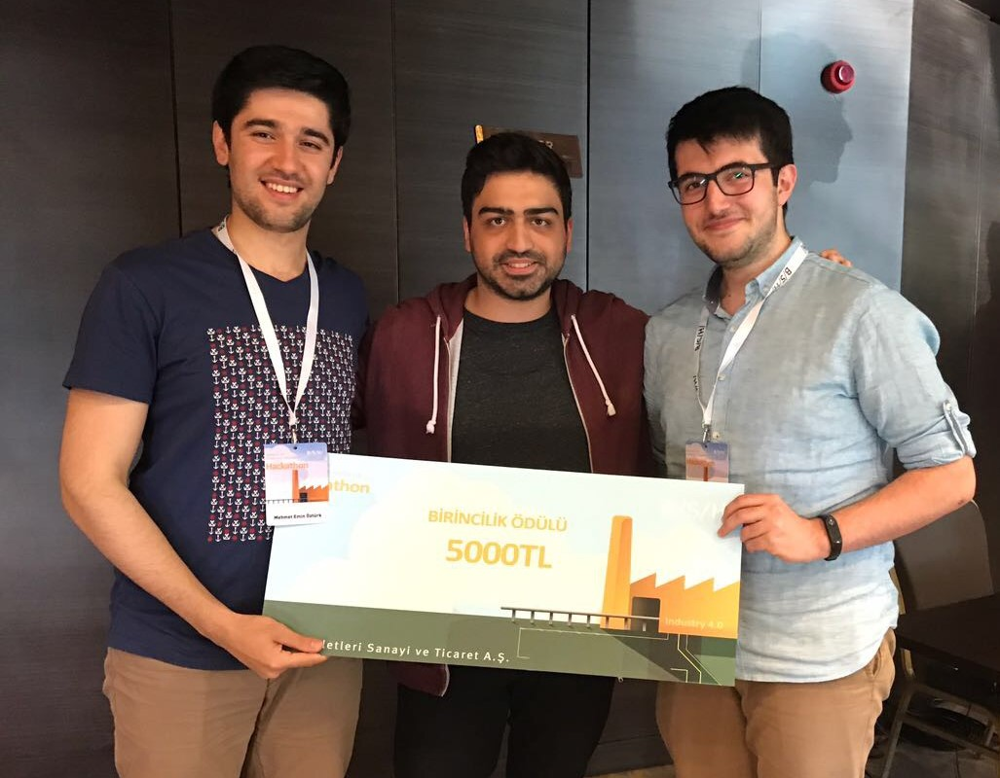

# Winning Solution to B/S/H Analytics for Production Excellence Hackathon 2017

We are proud of successfully winning the first place in Analytics for Production Excellence Hackathon arranged by BSH in Istanbul on 13-14 May 2017 to analyze BSH's Factory data regarding Production, Maintenance and Quality.

BSH wants to achieve Production Excellence. For this purpose, we were supposed to analyze data outcomes of Dishcare Factory and come up with an idea in order to decrease defects, scraps, customer returns, hence, increase overall customer satisfaction. So, There was no specific target or task. 

Here is a short sketch of steps of how Dishcare Factory Works:

There are three types of analysis data as result of this process:
* First Pass Yield – FPY: The yield is an indicator for the ratio of error-free products out of the total production.
* Weigthed Failure Rate – WFR: An indicator of possible claims from the field and reflects the quality of the entire manufacturing process. When totalling up individual defect rates, the respective defect rates must be weighted by production quantities.
* Technical Call Rate – TCR:  The key performance indicators Technical Call Rate (TCR),describes the ratio of failures of appliances produced in a defined manufacturing period and the number of appliances produced within this period.

Exploratory Data Analysis;
* Cleaning the Data from Unnecessary Variables
* Removing Duplicates in the Data
* Creating Standard Variable Names for All Tables
* Data Wrangling and Aggregation Activities
* Product or Group Based Daily and Monthly Plots

Feature Engineering;
* Daily and monthly production amounts of products and groups
* FPY and WFR Rates for each product and each group 
* TCR values for all groups
* Average repair costs of products and groups
* Average Lifetime of products and groups
* Extracting new features hidden in other variables like Export/Local

We developed a model to predict technical call rates, which can help BSH take precautions for the products with higher expected TCRs. 
* The ultimate aim is to foresee the Group of Products with higher TCRs even before the customers buy the products
* Calculating FPY and WFR rates by using production and error tables
* Calculating Technical Call Rates of Groups from historical repair data
* Creating a Feature Set including variables from FPY, WFR and Production Tables
* Applying Random Forest Regression to Predict TCRs

Our final model could explain the variation by 91.61%. Our value proposition and the model performance was the key in our success.

Thanks,

Emin
